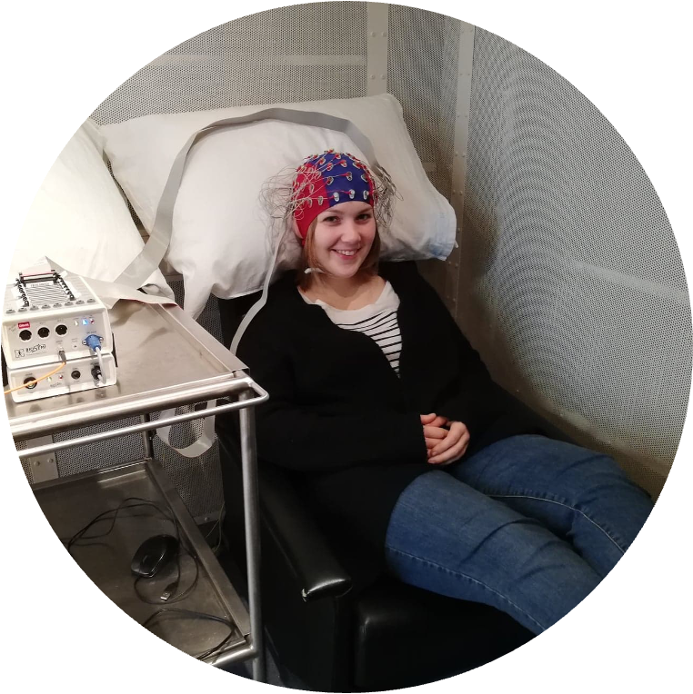

Hi! I'm a cogntive neuroscientist studying how speech is implemented in the brain. 
How does our brain make sense of the sounds that we're hearing? 
What happens in the brain while we speak? 
These are questions that I address in my research. I approach them using natural speech paradigms, neuroimaging, computational methods and cognitive tests in people with diverse language phenotypes, such as at different time points of the lifespan (development and aging) or in people with language disorders (for example aphasia, dyslexia, epilepsy). Characterizing speech processing in these populations helps (1) understanding the life stage or disorder better and (2) identifying crucial mechanisms for successful language processing in the neurotypical brain. My research contributes to both theoretical understanding and practical applications, exploring the potential for developing diagnostic tools. The neuroimaging techniques I have mainly focused on to achieve this are scalp EEG and intracranial EEG (stereoEEG).

You can find my publications on [Google Scholar](https://scholar.google.com/citations?user=qYgR5kpDKXcC&hl=en&oi=ao).

Currently, I am a postdoctoral researcher in the [Gwilliams Lab of Speech Neuroscience](https://gwilliamslab.stanford.edu/) at Stanford University (Dept. of Psychology), where I am advised by Prof. Laura Gwilliams. Previously, I did my PhD in Cognitive Neuroscience at the [Experimental ORL Laboratory](https://gbiomed.kuleuven.be/english/research/50000666/50000672) at KU Leuven in Belgium, advised by Prof. Maaike Vandermosten. Prior to that, I completed my Masters in Neuropsychology at Maastricht University, completing my thesis in the [Brain and Language lab](https://mbic-languagelab.nl/en/researcher/milene-bonte/) with Prof. Milene Bonte and Dr. Joao Correia. 

